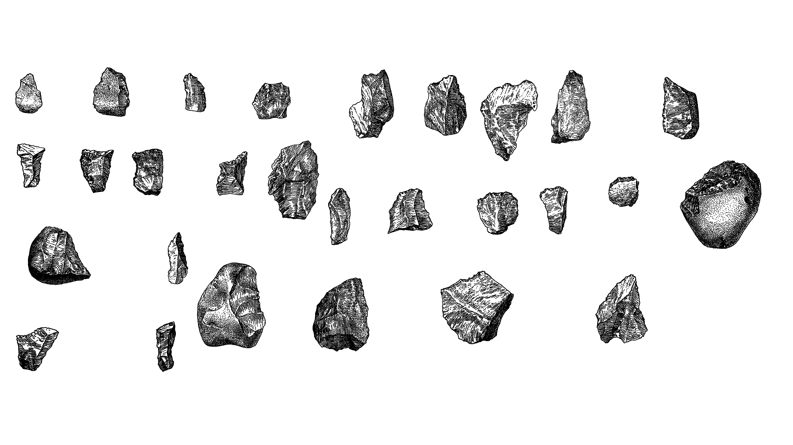
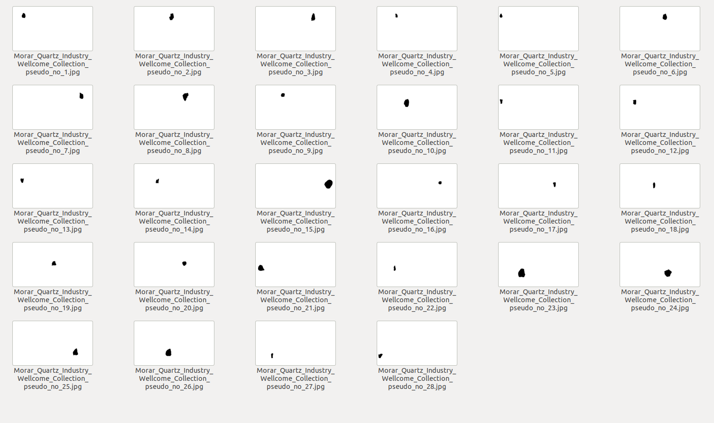
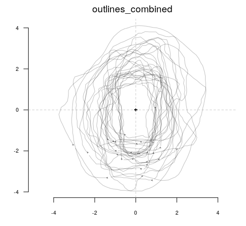
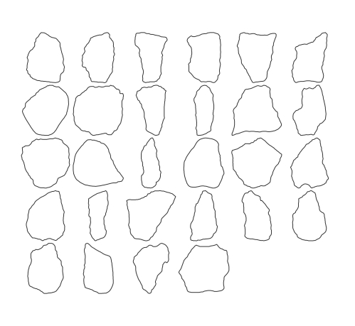

# outlineR
[](https://doi.org/10.5281/zenodo.4527469)

This package is a helpful wrapper around functions from mainly the __Momocs__ (Bonhomme et al. 2014), __EBImage__ (Pau et al. 2010), and __imager__ (Barthelme et al. 2020) packages. It is designed for the fast and easy extraction of single outline shapes of, for example, stone tools from images containing multiple thereof, such as the ones present in archaeological publications.


## Installation   

``` 
remotes::install_github("yesdavid/outlineR")
```

## Workflow

### Raw data

The raw data should have a sufficiently high resolution.

<table style="width:100%">
<tr>
<th>
<figure>

<figcaption>
Raw data (here: Morar Quartz Industry) as it can be found in archaeological publications. Credit: 
<a href="https://wellcomecollection.org/works/th7egtfj">Wellcome Collection</a> (CC BY 4.0).
</figcaption>
</figure>
</th>
<tr>
</table>

### Manual image preparation

The raw images have to be converted to JPEG format and manually prepared in an image manipulation software. Numberings, descriptions, etc. (everything we do not want an outline of) have to be removed by hand. If the image is a picture taken of the artefacts, make sure to remove any cast shadows. 

With the images cleaned, they now have to be thresholed/binarized[^1]. If not, the binarization happens inside the outlineR-package. However, it is not very robust and I advise you to do it manually beforehand.

[^1]: In GIMP2, images can be thresholded/biarized under "_Colors_" -> "_Thresholding..._"

<table style="width:100%">
<tr>
<th>
<figure>

<figcaption>
Manually prepared JPEG image with numberings etc. removed and thresholded using <a href="https://www.gimp.org/">GIMP</a>. It is suited to be used as input file for the `separate_single_artefacts` function and should therefore be saved in the `inpath`-folder (see below).
</figcaption>
</figure>
</th>
<tr>
</table>

### outlineR application

#### 1. Path settings

We define `inpath` as the pathname to out manually prepared image (see above). `outpath` defines the path to an empty folder where all prepared and singled-out artefacts should be saved to.
```
# For example:
# Define where the images containing multiple artefacts are right now.
inpath <- "./test_data/input_data" 

# Define where the separate images should be saved.
outpath <- "./test_data/derived_data" 
```

#### 2. Separation of single artefacts

`separate_single_artefacts` separates single artefacts from pictures with multiple artefacts on it.

```
separate_single_artefacts(inpath = inpath, 
                          outpath = outpath)
```

Afterwards, the JPEGs of the single artefacts should be saved in the folder which you defined under `outpath`. If there is just plain white images in your `outpath` folder, re-check the images you prepared in `inpath` for single outlier pixels or open outlines. If necessary, delete all JPEGS in `outpath`. Then, re-run this command.

<table style="width:100%">
<tr>
<th>
<figure>

<figcaption>
The single, separated artefacts from our input file generated using `separate_single_artefacts`, now located in `outpath`.
</figcaption>
</figure>
</th>
<tr>
</table>


####  3. Outline extraction

Using `Momocs::import_jpg()`, this function extracts the outlines of the images, while at the same time preserving the images' names. This function only needs the files in your `outpath` folder, so you do not (necessarily) have to run all of the code above again. If the pathname to a .tps file containing a scaling factor is provided to `tps_file_rescale`, the outlines will get scaled accordingly.

```
single_outlines_list <- get_outlines(outpath = outpath, tps_file_rescale = NULL)
```

####  4. Outline combination

The list of single outlines is combined into a single Out/Opn (Momocs) file.
``` 
outlines_combined <- combine_outlines(single_outlines_list = single_outlines_list)
```

#### 5. Outline inspection

In a last step before starting to work with your outlines, you should inspect the just created outlines for validity and possible errors.
```
length(outlines_combined) #how many outlines do you have?
stack(outlines_combined) # shows all outlines above one another(you might want to center and scale them first using Momocs)
Momocs::panel(outlines_combined) # shows all outlines next to each other
Momocs::inspect(outlines_combined) # shows only a single outline at a time. 
```

<table style="width:100%">
<tr>
<th>
<figure>

<figcaption>
Stacked outlines.
</figcaption>
</figure>

</th>
<th>
<figure>

<figcaption>
Panel of outlines.
</figcaption>
</figure>
</th>
<tr>
</table>

## References

__Barthelme et al. 2020__: Barthelme, S., Tschumperle, D., Wijffels, J., Assemlal, H. E., & Ochi, S. (2020). imager: Image Processing Library Based on “CImg” (0.42.3) [Computer software]. https://CRAN.R-project.org/package=imager

__Bonhomme et al. 2014__: Bonhomme, V., Picq, S., Gaucherel, C., & Claude, J. (2014). Momocs: Outline Analysis Using R. Journal of Statistical Software, 56(13). https://doi.org/10.18637/jss.v056.i13

__Pau et al. 2010__: Pau, G., Fuchs, F., Sklyar, O., Boutros, M., & Huber, W. (2010). EBImage—An R package for image processing with applications to cellular phenotypes. Bioinformatics, 26(7), 979–981. https://doi.org/10.1093/bioinformatics/btq046


